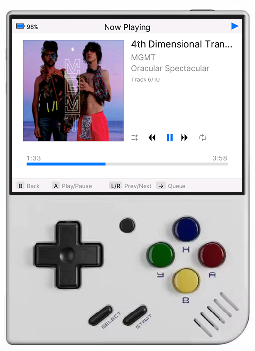

# MiyooPod

MP3 player for the Miyoo Mini Plus running OnionOS. Inspired by the classic iPod interface.



## ⚠️ First Release Notice

This is the first release of MiyooPod. While functional, it may contain bugs and rough edges. Please report any issues or request features on [GitHub Issues](https://github.com/danfragoso/miyoopod/issues).

## Features

- iPod-inspired user interface with multiple themes
- Browse by Artists, Albums, and Songs
- Album art display
- Automatic album artwork fetching from MusicBrainz
- Shuffle and repeat modes
- Native 640×480 resolution optimized for Miyoo Mini
- 11 customizable themes (Classic iPod, Dark Blue, Nord, Cyberpunk, and more)

## Installation

1. Download [MiyooPod.zip](https://github.com/danfragoso/miyoopod/raw/refs/heads/main/releases/MiyooPod.zip)
2. Extract the MiyooPod.zip file
3. Connect your Miyoo Mini Plus SD card to your computer
4. Copy the `MiyooPod` folder to `/App` on your SD card
5. Safely eject the SD card and insert it back into your Miyoo Mini Plus
6. MiyooPod will appear in your Apps menu

## Adding Songs

MiyooPod reads music files from your SD card's Music folder:

```
/mnt/SDCARD/Media/Music/
```

1. Connect your Miyoo Mini SD card to your computer
2. Navigate to `/Media/Music/` folder
3. Copy your MP3 files and folders into this directory
4. Organize your music by artist/album folders for better library organization
5. Launch MiyooPod - it will automatically scan and index your music library

## Recommended Format

**Officially Supported Format:** MP3 @ 256kbps

- **Format:** MP3 (MPEG-1 Audio Layer 3)
- **Bitrate:** 256kbps CBR (Constant Bitrate) or VBR V0
- **Sample Rate:** 44.1kHz
- **Channels:** Stereo

> **Note:** The Miyoo Mini Plus audio output is not high quality enough to justify higher bitrate files. Playback might be choppy with higher bitrate files.

## Album Artwork

### Embedded Artwork
MiyooPod automatically extracts album art embedded in your MP3 files' ID3 tags.

### Automatic Download from MusicBrainz
For albums without embedded artwork, MiyooPod can automatically fetch album covers:

1. Navigate to **Settings** from the main menu
2. Select **"Fetch Album Art"**
3. MiyooPod will scan your library and download missing album artwork

> **Note:** Requires internet connection via WiFi. Artwork is stored in `/mnt/SDCARD/Media/Music/.miyoopod_artwork/`

## Settings

- **Themes** - Choose from 11 visual themes (Classic iPod, Dark, Dark Blue, Light, Nord, Solarized Dark, Matrix Green, Retro Amber, Purple Haze, Cyberpunk, Coffee)
- **Lock Key** - Customize which button locks/unlocks the screen (Y, X, or SELECT). The Miyoo Mini Plus doesn't support suspend mode natively, so the lock key prevents accidental presses during playback
- **Fetch Album Art** - Automatically download missing album artwork from MusicBrainz
- **Toggle Logs** - Enable or disable debug logging
- **Rescan Library** - Force a complete rescan of your music library
- **About** - View app version and check for updates

## Technical Details

Built using **Go 1.22.2** with native C bindings (CGO) for graphics and audio.

### Architecture
- **Platform:** Miyoo Mini Plus / OnionOS
- **CPU:** ARM Cortex-A7 (dual-core)
- **Resolution:** 640×480 native
- **Cross-compilation:** arm-linux-gnueabihf-gcc

### Key Libraries
- **SDL2** - Graphics, input handling, window management
- **SDL2_mixer** - Audio playback with MP3 decoding (libmpg123)
- **fogleman/gg** - 2D graphics rendering
- **dhowden/tag** - ID3 tag parsing
- **golang.org/x/image** - Image processing and font rendering

### Performance Optimizations
- Dual-core utilization (UI and audio on separate cores)
- Pre-rendered digit sprites for time display
- Text measurement and album art caching
- Library metadata cached as JSON for fast startup

## Building from Source

```bash
# Cross-compile for ARM
make go
```

The build process uses CGO to compile Go source with C bindings and bundles all required shared libraries.

## Contributing

MiyooPod is open-source! Contributions are welcome.

- **Report bugs:** [GitHub Issues](https://github.com/danfragoso/miyoopod/issues)
- **Request features:** [New Issue](https://github.com/danfragoso/miyoopod/issues/new)
- **Submit PRs:** [Pull Requests](https://github.com/danfragoso/miyoopod/pulls)

## License

Open Source

## Author

Created by [Danilo Fragoso](https://github.com/danfragoso)

---

